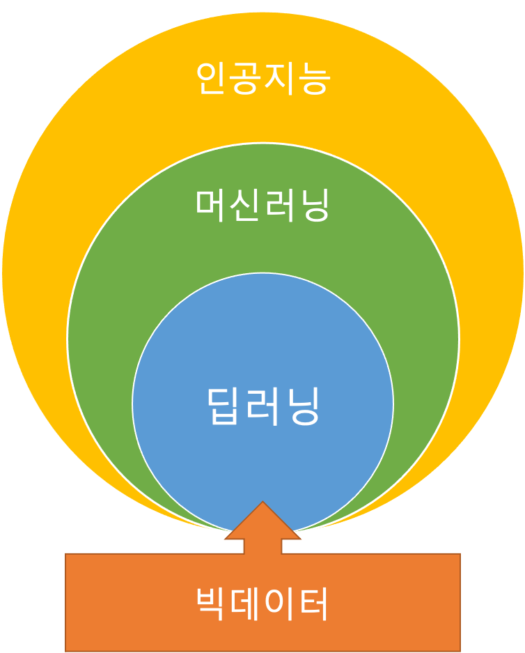
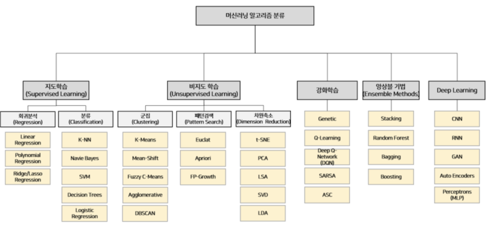
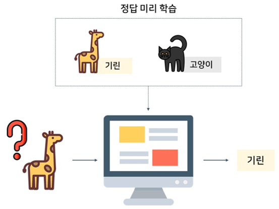
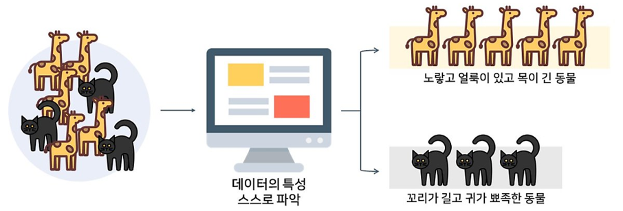
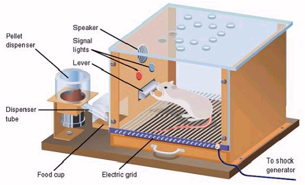

# 머신러닝의 이해

## #01. 인공지능, 머신러닝, 딥러닝

### 1) 인공지능(AI)

- 컴퓨터가 인간과 같은 지능적인 행동을 할 수 있게 해주는 기법들을 연구하는 분야.

### 2) 머신러닝 (Machine Learning)

- 인공지능 연구분야의 방법론 중 하나.
- 데이터를 이용해 컴퓨터가 어떤 지식이나 패턴을 학습하는 것.
- 지도학습, 비지도학습, 강화학습 등의 방법론(알고리즘)이 있음.
- 대표적인 파이썬 패키지: sklearn

### 3) 딥러닝 (Deep Learning)

- 머신러닝의 여러 방법론 중 하나.
- 인공신경망을 깊게 여러 층 쌓아 올려 학습하는 방식
- 대표적인 파이썬 패키지 : Tensorflow

## #02. 전통적인 프로그래밍과 머신러닝의 차이

### 1) 프로그래밍

논리적인 흐름을 만드는 것이 중요함.

### 2) 심볼릭 AI

명시적인 규칙을 충분하게 만들어 지식을 다루면 인간 수준의 인공지능을 만들 수 있다고 생각하는 방법.

if문의 복잡한 구성

1950년대~1980년대까지의 지배적인 패러다임

### 3) 머신러닝

데이터와 결과값을 통하여 규칙을 찾아내는 것이 목적.

## #03. 머신러닝의 분류

## 1) 알고리즘 분류

### 지도학습

의도하는 결과가 있을 때 사용

학습하는 동안 모델은 입력으로 들어온 값으로 변수를 조정하여 출력에 매핑한다.

### 비지도학습

의도하는 결과가 없을 때 사용한다.

입력 데이터 집합을 비슷한 유형의 집합으로 분류한다.

### 강화학습

- 결정을 내리도록 할 때 사용한다.
- 결정을 했을 때의 성공/실패에 따라 주어진 입력값에 대한 결정이 점차 달라진다.
- 학습을 할 수록 입력에 대한 결과 예측이 가능하게 된다.

## 2) 분석 목적에 따른 알고리즘 구분

